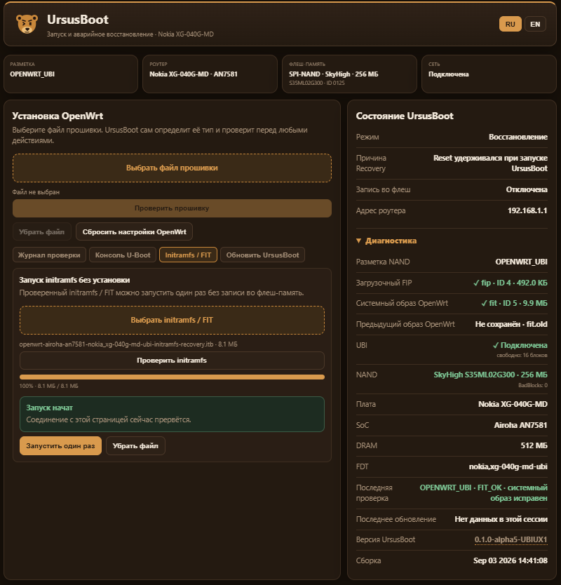

<div align="center">

# 🐻 UrsusFlasher

### OpenWrt на Nokia XG-040G-MD: установка, резервные копии и восстановление

**Airoha AN7581 · SPI-NAND 256 МиБ · UrsusBoot · OpenWrt**


**[📦 Скачать готовый комплект](../../releases/latest)** · [инструкция](docs/INSTRUCTIONS_RU.md) · [аварийное восстановление](docs/EMERGENCY_URSUSBOOT_RU.md)

</div>

---

## Коротко

В комплекте две вещи, и они делают разное.

**UrsusFlasher** запускается на компьютере. Он смотрит, в каком состоянии сейчас роутер, и сам выбирает, как с ним разговаривать: через веб-интерфейс заводской прошивки, через SSH установленной OpenWrt, через веб-интерфейс собственного загрузчика или, если совсем всё плохо, через USB-UART.

**UrsusBoot** живёт в самом роутере. Это загрузчик со встроенной средой восстановления: он умеет принять образ по сети, проверить его и записать. Именно он превращает «роутер не грузится» из приговора в обычную процедуру.

Интернет во время прошивки не нужен — все образы лежат в комплекте.

<div align="center">



<sub>UrsusBoot 0.1.0-alpha5-UBIUX1 в режиме восстановления. Слева — установка OpenWrt и разовый запуск initramfs без записи, справа — состояние и диагностика: разметка, тома `fip` и `fit`, NAND и сбойные блоки.</sub>

</div>

Так выглядит роутер, на котором OpenWrt уже стоит: разметка `OPENWRT_UBI`, и поэтому видна кнопка «Сбросить настройки OpenWrt». На заводской прошивке её на этом месте не будет — что появляется и при каких условиях, разобрано в [инструкции](docs/INSTRUCTIONS_RU.md).

---

## Откуда взялся UrsusBoot

Сначала его не было. Первые версии UrsusFlasher работали поверх китайского хрупкого `tcboot` — загрузчика, который достался из Поднебесной готовым двоичным файлом. Он работал, на живом железе это было подтверждено, но исходников у него не обнаружилось.

Поэтому направление сменилось: загрузчик стали собирать из актуального OpenWrt/Airoha U-Boot, добавив к нему собственный слой модификаций, Webfailsafe интерфейс. Так появился UrsusBoot. `tcboot` остался в истории как справочный образец поведения — по нему сверялись, но в комплекте его больше нет.

Заодно поменялась и разметка. Ранние эксперименты сдвигали начало UBI, чтобы освободить место под свой загрузчик, — и за это приходилось платить: официальный образ OpenWrt переставал подходить, его разметку флеш-памяти роутера нужно было править на лету. Сейчас разметка совпадает с той, которую OpenWrt ожидает для этой платы:

```text
0x00000000..0x0001ffff   BL2
0x00020000..конец NAND   UBI
                           ubootenv, ubootenv2, bosa, ri
                           fip          ← сюда попадает UrsusBoot
                           fit          ← ядро и корневая файловая система
                           rootfs_data
```

Благодаря этому официальный `*-ubi-*` образ OpenWrt встаёт как есть, без переделок. А сам загрузчик хранится не в отдельном куске «сырой» флеш-памяти, а в томе `fip` внутри UBI — там же, где его ищет штатная загрузочная цепочка роутера.

---

## Что UrsusBoot делает и чего не делает

**Делает:**

- принимает образ OpenWRT прошивки (UBI/factory) по сети — через свою веб-страницу или, если она не отвечает, по TFTP;
- проверяет образ до записи: тип, размер, контрольную сумму;
- делает переразметку в случае необходимости и в соответствии с образом, пишет и **читает обратно**, сверяя записанное с тем, что должно было получиться;
- поднимается по кнопке Reset, даже когда установленной системы уже нет (удержанием reset 10+ сек ПОСЛЕ включения, пока не загорится красный LED);
- сам определяет текущую разметку роутера и класс загруженного образа и сообщает их;
- работает автономно: чтобы поставить или переустановить OpenWrt, ему не нужны ни рабочая система на роутере, ни компьютер с UrsusFlasher — достаточно его собственной веб-страницы.

Он переживает `sysupgrade`, запущенный изнутри OpenWrt: тот пишет `fit` и `rootfs_data`, а том `fip` с загрузчиком не трогает. И он умеет выполнить sysupgrade сам — это два разных пути к одному результату, а не один вместо другого.

**Не делает:**

- не заменяет резервную копию: он может вернуть роутер к жизни, но не вернёт ваши заводские данные, если копии нет;
- не переписывает себя при обычном обновлении OpenWrt: обновление загрузчика — отдельная операция, а не побочный эффект прошивки;
- не решает, какие переходы между разметками допустимы, — это правила UrsusFlasher, см. ниже.

Один практический вывод: **резервная копия — не формальность.** Загрузчик восстанавливается, заводские MAC-адреса и калибровочные данные — нет.

### Переходы между разметками разрешены не любые

Разметку и класс образа определяет UrsusBoot, а решение «такой переход можно, такой нельзя» принимает UrsusFlasher на компьютере:

| Откуда | Куда | |
|---|---|---|
| Заводская Nokia | OpenWrt с разметкой UBI | можно, если подтверждён кандидат на переход |
| Заводская Nokia | OpenWrt в заводской разметке | можно, если для неё есть проверенный образ |
| OpenWrt в заводской разметке | OpenWrt с разметкой UBI | можно **из Recovery**, начиная с 0.2.56 |
| OpenWrt с разметкой UBI | OpenWrt в заводской разметке | **нельзя** |

До 0.2.56 переход из заводской разметки в UBI был закрыт: разметку выбирали один раз, при уходе со стоковой прошивки. Теперь он есть, но идёт только через UrsusBoot Recovery и тем же разрушительным путём миграции, что и переход с заводской Nokia, — то есть с теми же проверками UBI-образа, transition preloader/BL2 и физической разметки.

Обратный путь по-прежнему закрыт: с UBI обратно на заводскую разметку вернуться нельзя. Если попытаться, UrsusFlasher откажет до начала записи и объяснит причину.

---

## Что нового в 0.2.56

**Настройки OpenWrt при обновлении теперь ваш выбор.** В Recovery у обновления UBI появилась галочка «сохранить настройки»: можно обновиться, оставив `rootfs_data` как есть, а можно поставить начисто. Отдельным пунктом там же — сброс настроек, и он работает и для UBI, и для заводской разметки. Из UART то же самое делает команда `ursussettings reset`.

**Размер overlay больше не «плавает».** При чистой установке или сбросе `rootfs_data` разворачивается на максимум минус 16 свободных PEB, и это значение записывается в environment загрузчика. После обычного `sysupgrade` из OpenWrt overlay получится того же размера, а не другого.

**Переход из заводской разметки OpenWrt в UBI** — описан выше, это главное изменение.

**Определение среды стало строже.** OpenWrt опознаётся по root SSH, заводская Nokia — по Web и Telnet. Один только открытый Telnet больше не считается доказательством стоковой прошивки, а если среда не опознана однозначно, работа останавливается, а не продолжается наугад.

Образы OpenWrt в комплекте те же, что в 0.2.55, — менялся загрузчик и логика вокруг него.

---

## С чего начать

> [!IMPORTANT]
> **Сначала сбросьте Nokia на заводские настройки.** Это нужно перед каждой итерацией — и перед первой установкой, и перед любым повтором после неудачи. Сброс делается на стоковой прошивке: зажать Reset и держать **не меньше 20 секунд**, отпустить, дождаться перезагрузки.
>
> Иначе состояние стоковой системы неизвестно: остаются изменённые настройки, включённые или выключенные службы и следы прошлых попыток, из-за которых определение устройства и доступ могут повести себя не так, как ожидается.

Распакуйте архив и запустите из его папки:

| | Windows | Linux / macOS |
|---|---|---|
| **Обычная установка** | `START_ONECLICK.cmd` | `./START_ONECLICK.sh` |
| **Ручной режим** | `START_EXPERT.cmd` | `./START_EXPERT.sh` |

Нужен Python 3 и кабель Ethernet. Больше ничего устанавливать не надо.

Если задача простая — «поставить OpenWrt» — запускайте **ONE-CLICK**. Если нужно что-то конкретное: обновить только загрузчик, снять копию, разобраться, почему роутер молчит, — **EXPERT**.

### Каким портом подключаться

**Для прошивки рекомендуется использовать порты LAN2 или LAN3.**

- **LAN1** — отдельный чип на 2,5 Гбит/с (PHY EN8811H), которому нужна своя инициализация. Для прошивки он не годится.
- **LAN4** после загрузки комплектной OpenWrt становится WAN, и `192.168.1.1` по нему пропадёт прямо посреди работы.

---

## Как работает ONE-CLICK

ONE-CLICK не предполагает, что роутер находится в каком-то одном состоянии. Он сначала смотрит, что там, и уже потом выбирает маршрут.

**Роутер на заводской прошивке Nokia.** Флешер заходит в веб-интерфейс, получает root по Telnet и снимает полную копию флеш-памяти по TFTP. Копия проверяется. Только после этого готовится новый загрузочный блок, записывается, вычитывается обратно целиком и сверяется. Дальше роутер уходит в UrsusBoot Recovery, куда и отдаётся OpenWrt.

**На роутере уже OpenWrt.** Разговор идёт по root SSH. Если том `fip` существует, обновляется он; физический загрузочный блок трогается только тогда, когда цель подтверждена однозначно. Дальше — обратное чтение, сверка и переход в Recovery. Система, установленная во флеш-памяти, и система, запущенная из оперативной памяти, различаются и показываются отдельно.

**Уже открыт UrsusBoot Recovery.** Тогда переустанавливать загрузчик не нужно: образ передаётся частями, проверяется загрузчиком и записывается.

Общее правило одно: **запись загрузчика не начинается, пока проверенной копии нет.**

### ONE-CLICK всегда ставит разметку UBI

Это стоит сказать прямо, потому что выбора он не предлагает. В комплекте два образа OpenWrt — для разметки UBI и для заводской, — но **ONE-CLICK во всех своих ветках берёт только UBI**. Это осознанно: UBI и есть целевая разметка, в ней живёт загрузчик и работает всё остальное.

Если вам нужна именно **заводская разметка**, есть два пути, и оба ручные:

- **EXPERT, пункт 3 «Записать пользовательскую прошивку OpenWrt».** Он принимает любой `.bin`/`.itb` — укажите комплектный `fw/openwrt-airoha-an7581-nokia_xg-040g-md-squashfs-sysupgrade.bin`. Класс образа определяется автоматически, и запись пойдёт по заводскому пути.
- **Веб-интерфейс UrsusBoot напрямую.** Загрузите тот же файл в Recovery и нажмите «Установить в заводскую разметку».

Обратите внимание на односторонность из таблицы выше: уйти в заводскую разметку можно с заводской Nokia, но **не** с уже установленной OpenWrt UBI — такой образ будет отклонён до записи.

---

## Каналы управления и передачи файлов

| Состояние роутера | Команды идут через | Файлы идут через |
|---|---|---|
| Заводская Nokia | HTTP/Web + Telnet | TFTP |
| OpenWrt во флеш-памяти | SSH | SCP |
| OpenWrt из оперативной памяти | SSH | SCP |
| UrsusBoot Recovery | HTTP API | HTTP по частям |
| UrsusBoot Recovery, запасной путь | консоль UrsusBoot | TFTP |
| Роутер не загружается | USB-UART → Airoha BootROM | XMODEM |

USB-UART подключается только по **TX, RX и GND**. VCC к плате не подключается.

---

## Меню EXPERT: что каким путём идёт

Знак `!` означает, что пункт может писать во флеш-память.

### Установить

| | Пункт | Каким путём |
|---|---|---|
| `!` | **1** Установить OpenWrt | то же, что ONE-CLICK, но каждый шаг подтверждаете вы |
| `!` | **2** Установить или обновить UrsusBoot | заводская Nokia → Web + Telnet; OpenWrt → SSH; Recovery → HTTP, при сбое TFTP |
| `!` | **3** Записать пользовательскую прошивку OpenWrt | OpenWrt → SSH, сначала `sysupgrade -T`, потом запись; Recovery → HTTP |

Пункт **4** объединён со вторым: ввод `4` работает как псевдоним и оставлен для привычки.

### Если роутер не загружается

| | Пункт | Каким путём |
|---|---|---|
| `!` | **5** Восстановить загрузчик | USB-UART → Airoha BootROM → служебный UrsusBoot в RAM → запись и проверка |
| `!` | **6** Восстановить заводскую прошивку Nokia | **пока не работает** — путь спроектирован, но не подключён |

### Резервные копии

| Пункт | Каким путём |
|---|---|
| **7** Создать полную копию flash-памяти | SSH только чтобы понять разметку → BootROM/USB-UART → чтение NAND из RAM → копия на компьютер. Ничего не пишет |
| **8** Проверить резервную копию | локально на компьютере: состав, размеры, SHA256 |
| **9** Собрать комплект восстановления | **пока не работает** |

### Посмотреть

| Пункт | Каким путём |
|---|---|
| **10** Состояние устройства и доступные операции | пассивный опрос Web/SSH; при необходимости спросит пароль |
| **11** Flash-память, разметка и сбойные блоки | Web/SSH, при необходимости USB-UART; только чтение |
| **12** Проверить файлы комплекта | локальная сверка SHA256 и состава |

Пункты **6** и **9** в этой сборке выбрать можно, но выполнить нельзя: они честно сообщают, что backend не подключён, вместо того чтобы делать вид.

---

## Что проверяется перед записью

Работа разделена на три независимые вещи: понять состояние, передать файл, записать. Между ними стоят проверки.

Сверяются файлы комплекта, модель и SoC, текущая разметка, конкретная цель записи, состояние резервной копии и — уже на стороне роутера — размер и хеш переданного файла.

Фоновая диагностика в EXPERT ничего не разрешает и не запрещает, она информационная. Всё, что действительно нужно операции, она проверяет сама, уже после того как вы её выбрали. Пароль root, если он понадобится, спросит системный OpenSSH; UrsusFlasher его не хранит и ключей на роутер не подкладывает.

---

## Что проверяется после записи

Успешный код возврата команды записи ничего не доказывает, поэтому результат вычитывается обратно: для загрузочного блока целиком 512 КиБ со сверкой SHA256, для тома `fip` — весь записанный FIP. Когда это возможно, после перезагрузки проверяется ещё и то, какая среда фактически ответила.

Если сверка не сошлась, автоматической повторной попытки другим способом не будет: это тот случай, когда правильно остановиться и посмотреть.

---

## Резервная копия

Пункт **7** ничего не пишет.

На заводской Nokia сохраняются `mtd0..mtd16` вместе со сведениями о разметке и данными, по которым потом можно доказать, что копия именно от этого устройства. Дополнительные службы ради копирования не включаются.

Если снять копию из работающей системы безопасно нельзя, используется путь через Airoha BootROM: среда поднимается в оперативной памяти, флеш-память при этом не меняется, и чтение идёт из состояния, где никто не пишет в NAND у вас за спиной. Для OpenWrt с UBI так сохраняется весь физический `mtd0` на 256 МиБ (`mtd0_all_flash.bin.gz`) с повторной сверкой SHA256, плюс удобные срезы `mtd1_bl2` и `mtd2_ubi`.

Копия, снятая из работающей записываемой OpenWrt, за точную копию для полного восстановления не выдаётся.

---

## Что в комплекте

Два образа OpenWrt (сборка UnameOne от 06.09.2026, `r36009+75-6c315233aa`, ядро 6.18.44):

```text
fw/openwrt-airoha-an7581-nokia_xg-040g-md-squashfs-sysupgrade.bin       заводская разметка
fw/openwrt-airoha-an7581-nokia_xg-040g-md-ubi-squashfs-sysupgrade.itb   разметка UBI
```

Комплектный UrsusBoot `0.1.0-alpha5-UBIUX1` знает Fudan FM25G01B/FM25G02B, а также SkyHigh, Fudan FM25S01A и Winbond. Он собран поверх alpha4-FUDAN1: BL2 и preloader не менялись, менялся BL33.

> **Про статус alpha5.** Сборка и упаковка проверены, но отдельного приёмочного прогона на живом роутере для новой логики Recovery/UBI ещё не было. Пока это `HW_REGRESSION_REQUIRED`, и на Fudan-NAND приёмка тоже остаётся незакрытой.

Точные размеры и контрольные суммы всех компонентов — в `SHA256SUMS` и `data/MANIFEST.json`. Полная строка версии сборки лежит в `VERSION`: она длинная и нужна инструментам, а не человеку.

---

## Проверить, что комплект цел

Из меню — пункт **12**. Из командной строки для всего репозитория:

```bash
python3 scripts/verify_repo.py
```

Проверяются контрольные суммы, манифесты, загрузочные компоненты, синтаксис Python-файлов и встроенные самопроверки.

На Windows клонируйте репозиторий в короткий путь. Если Git ругается `Filename too long`:

```powershell
git config --global core.longpaths true
```

`.gitattributes` фиксирует LF для текста и CRLF для `.cmd`, так что `SHA256SUMS` сходится независимо от настроек `core.autocrlf`.

---

## Релизы

Публикуется только готовый пользовательский комплект — [последний релиз](../../releases/latest). Сборка запускается вручную через GitHub Actions (**Public test release**) и перед публикацией проверяет репозиторий, собирает архив и отдельно проверяет уже собранный архив.

SDK, компиляторы, деревья сборки и инструменты разработки в этот архив не входят: они нужны репозиторию, а не тому, кто прошивает роутер.

---

## Документация

- [`docs/INSTRUCTIONS_RU.md`](docs/INSTRUCTIONS_RU.md) — как пользоваться, по шагам.
- [`docs/EMERGENCY_URSUSBOOT_RU.md`](docs/EMERGENCY_URSUSBOOT_RU.md) — восстановление через USB-UART, когда роутер молчит.
- [`docs/CHANGELOG_RU.md`](docs/CHANGELOG_RU.md) — что менялось от версии к версии.
- [`FILES.md`](FILES.md) — из чего состоит репозиторий.

---

## Лицензии

См. [`LICENSE-NOTICE.md`](LICENSE-NOTICE.md). В репозитории есть компоненты нескольких внешних проектов; при распространении их уведомления и лицензии нужно сохранять.
